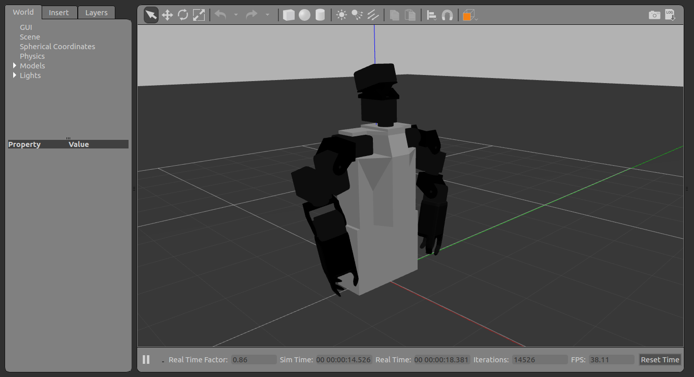
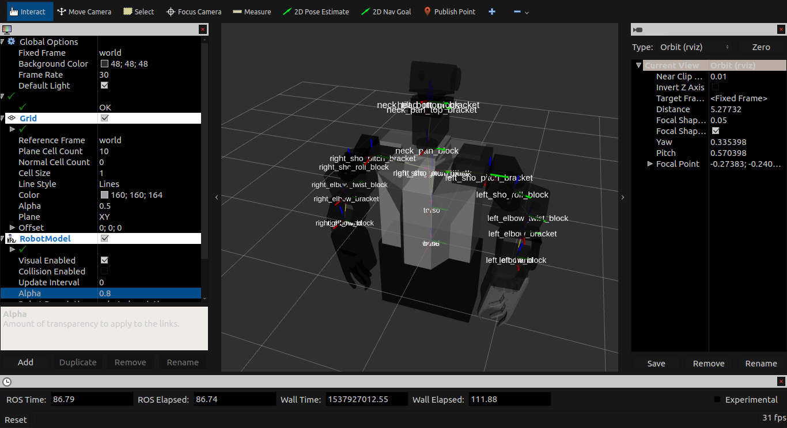
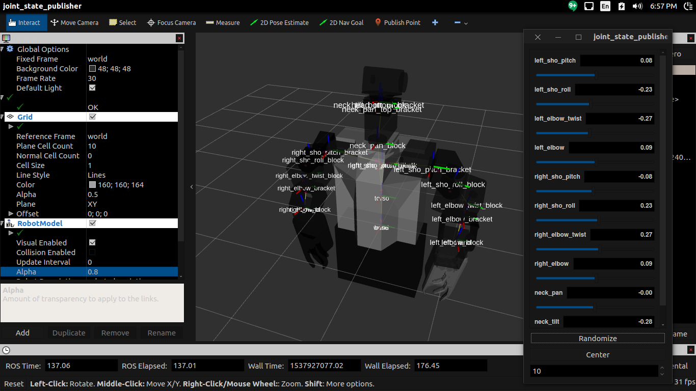
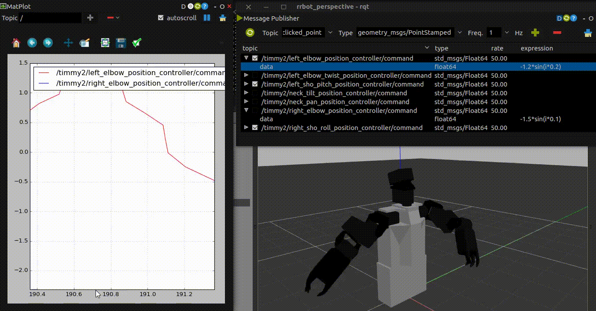

# Timmy2 Gazebo ROS

A set of ROS packages for simulating the Timmy2 robot (based on HROS-1 robot) in **[Gazebo](gazebosim.org)** and **[Rviz](wiki.ros.org/rviz)**.

There are two ROS packages in this project: `timmy2_description` and `timmy2_control`.

## timmy2_description

This package mainly contains the *model* of Timmy2 written in URDF/Xacro format.

The 3D meshes of Timmy2 were made using Blender 2.79 and exported to `.dae` (Collada) format.

The current model of Timmy2 is described in the `urdf/timmy3.urd.xacro` file, and uses the meshes located in the `meshes2/` directory.


Fig. 1: Timmy2 in Gazebo


Fig. 2: Timmy2 in Rviz


Fig. 3: Timmy2 in Rviz with Joint State Publisher GUI

### Current state/issues
-  To run all (Gazebo, Rviz, Joint State Publisher) run:

   `$ roslaunch timmy2_description timmy_description.launch`

   This will load the `timmy3.urdf.xacro` model and launch Gazebo. Additionally, it will launch (i.e. `<include ...>` the `timmy2_control/timmy2_control.launch` file (see details below)

-  The current Timmy2 model has a twist DOF at the elbow. The original HROS-1-based model does not have this DOF. Use the `timmy2.urdf.xacro` in the launch file for this original model.
   ```XML
   <!--timmy_description.launch-->
   ...
   <arg name="model" default="$(find timmy2_description)/urdf/timmy2.urdf.xacro"/>
   ...
   ```
-  Cannot use both the `joint_state_publisher` and Gazebo simulation. When Gazebo is running, `robot_state_publisher` which connects Gazebo to ROS will continuously publish a stream of output of the physics simulation in Gazebo to `/timmy2/joint_state` topic (`JointState` type) which will override any values published by `joint_state_publisher`.

   The effects of `joint_state_publisher` can be seen briefly in Rviz, but will quickly revert to the state reflected in Gazebo.

   `joint_state_publisher` currently has no effect to the model in Gazebo.

-  The model can be moved using two other methods: *directly publishing to a joint topic from the Terminal* or *using rqt_gui* (see below)

-  Currently, it's best to choose either: a) use Gazebo and move the model using direct topic publishing or *rqt_gui* OR b) use only `joint_state_publisher` and disconnect Gazebo simulation. See below for instructions/commands.

## timmy2_control

This package contains configurations for/to:
-  spawn joint controllers (from `controller_manager` package)
   -  This is used to connect **ROS** with **Gazebo** (i.e. so publishing joint position from ROS will be reflected in Gazebo, and vice versa)
-  launch `joint_state_publisher`
   -  This is for manual control of each joint via *slider bars* (GUI).
-  launch `robot_state_publisher`
   -  From [Gazebo tutorial](http://gazebosim.org/tutorials/?tut=ros_control#Createa.yamlconfigfile)
   > ...listens to /joint_states messages from the joint_state_controller then publishes the transforms to /tf. This allows you to see your simulated robot in Rviz as well as do other tasks.

-  launch **Rviz**

## Instructions/How-To's

### Launch everything
```bash
$ roslaunch timmy2_description timmy_description.launch
```

**NOTE:** The current configuration tries to make `joint_state_publisher` and Gazebo work at the same time. This is achieved by commenting the `remap` argument for `robot_state_publisher` in `timmy2_control/launch/timmy2_control.launch`

```XML
<!-- Joint state publisher GUI -->
<param name="use_gui" value="${arg gui}"/>
<node name="joint_state_publisher" pkg="joint_state_publisher" type="joint_state_publisher">
    <rosparam param="source_list">["timmy2/joint_states"]</rosparam>
</node>

<!-- Convert joint states to TF transforms for rviz, etc -->
<node name="robot_state_publisher" pkg="robot_state_publisher" type="robot_state_publisher"
    respawn="false" output="screen">
    <!--remap from="/joint_states" to="/timmy2/joint_states" /-->
</node>
```

### Turn off Gazebo and Use `joint_state_publisher` GUI

1.  Comment the `rosparam` line for `joint_state_publisher` in `timmy2_control/launch/timmy2_control.launch`
   ```XML
   <node name="joint_state_publisher" pkg="joint_state_publisher" type="joint_state_publisher">
      <!--rosparam param="source_list">["timmy2/joint_states"]</rosparam-->
   </node>
   ```

2.  Launch everything (see above)  

### Only Use Gazebo as Control
**WARNING:** `joint_state_publisher` will not work.

1.  Uncomment `rospoaram` line for `joint_state_publisher` and `remap` for `robot_state_publisher` in `timmy2_control/launch/timmy2_control.launch`

    ```XML
    <!-- Joint state publisher GUI -->
    <param name="use_gui" value="${arg gui}"/>
    <node name="joint_state_publisher" pkg="joint_state_publisher" type="joint_state_publisher">
        <rosparam param="source_list">["timmy2/joint_states"]</rosparam>
    </node>

    <!-- Convert joint states to TF transforms for rviz, etc -->
    <node name="robot_state_publisher" pkg="robot_state_publisher" type="robot_state_publisher"
        respawn="false" output="screen">
        <remap from="/joint_states" to="/timmy2/joint_states" />
    </node>
    ```

2.  Launch everything (see above)


## Publish Joint Positions

1.  Launch everything
    ```bash
    $ roslaunch timmy2_description timmy_description.launch

    ```

2.  In a new Terminal
    ```bash
    $ rostopic pub -1 /timmy2/right_elbow_position_controller/command std_msgs/Float64 "data: 1.5"
    ```
    Change `right_elbow_position_controller` to any other joint topics i.e. `<joint_name>_position_controller/command` and give `data` some value (Float64, in radians).


## Move Model using `rqt_gui`

1.  Launch everything
    ```bash
    $ roslaunch timmy2_description timmy_description.launch

    ```

2.  In a new Terminal
    ```
    $ rosrun rqt_gui rqt_gui
    ```

3.  Open a *Message Publisher* panel
4.  Press the green PLUS button to add a new message to publish
5.  Click the checkbox to make the message active
6.  Choose the topic to publish to e.g. `/timmy2/right_elbow_position_controller/command`
7.  Make sure the type is correct: `std_msgs/Float64`
8.  Choose a rate to publish the message (50 or 100Hz is good)
9.  In the **Expressions** field, enter a value or a math expression.
   -  `i` is the default variable of time.
   -  Cyclic expressions using `sin` or `cos` will create cyclic motions. e.g. `1.5*sin(i*100)`
   -  Expressions are assumed to follow Python expressions (i.e. as if you were to write the expression in Python). See Fig 4 below.


Fig. 4: Moving Timmy2 model using `rqt_gui`
